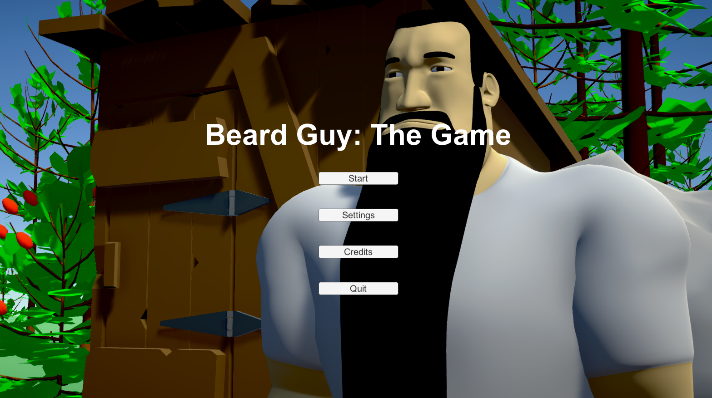
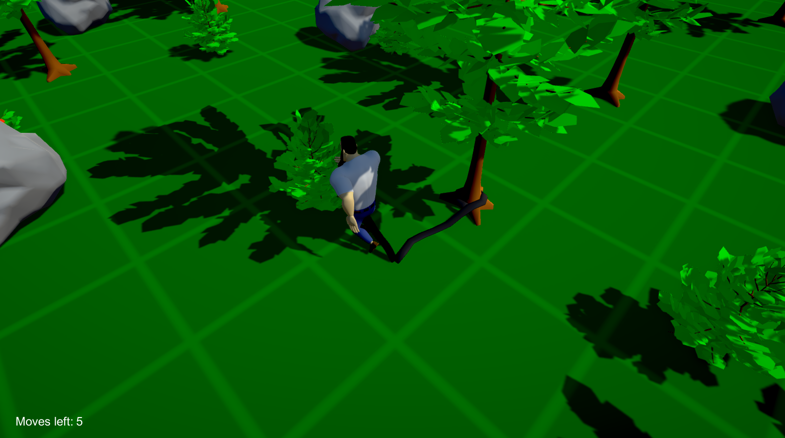
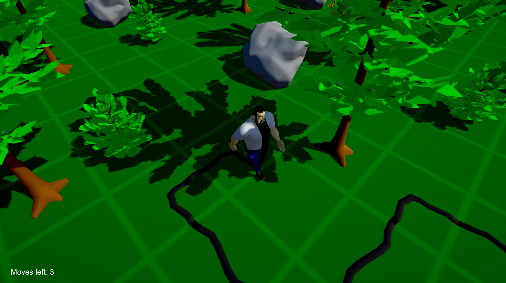
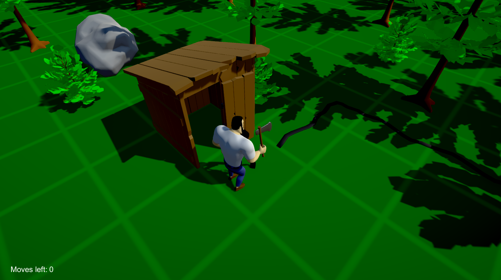

# Beard Guy: The Game
This was a 3-person team project from a game jam at Pelitalo Score (A Finnish gaming-related youth activity center). The theme of the jam was "puzzle game" and about 15-20 hours were spent on it over a few days.

## Plot
This isn't just a game. It's a *story.* A tragic story. A story about a beard... and what a glorious, happy beard it was!

Or so things would've been, if it wasn't for Jaska. He was a man stronger than nine reindeer and *he* would no longer appreciate his rough and bushy companion after it chose to attach itself to an even sturdier tree. This life-long friendship was *over.*

## Features
- a beard
- a menu
- one static level with
  - Jaska's beard, firmly attached to a tree, never to be untied again
  - the player (Jaska)
  - obstacles such as trees, rocks, and bushes
    - some of the bushes have berries that instantly grow Jaska's beard... don't ask.
  - a wooden shed with an axe in it
    - the player must reach this shed to finish the job
- lovingly crafted 3D representation of Jaska's beard
- and Jaska, with life-like ear-picking animations
- and the rest of the game world, also in 3D

## Screenshots

